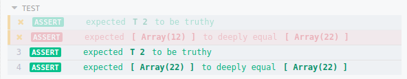

<div align="center">
    
    <h1>cypress-plugin-retries</h1>
    <a href="https://www.npmjs.com/package/cypress-plugin-retries"></a>
    <a href="https://www.npmjs.com/package/cypress-plugin-retries"></a>
    <a href="https://github.com/bkucera/cypress-plugin-retries/blob/master/LICENSE"></a>

<p>A Cypress plugin to retry failed tests</p>

</div>

> **Please report bugs in the issues of this repo.**

> [Please refer to this issue for updates about official cypress retry support](https://github.com/cypress-io/cypress/issues/1313)




### Installation

Add the plugin to `devDependencies`
```bash
npm install -D cypress-plugin-retries
```

At the top of **`cypress/support/index.js`**:
```js
require('cypress-plugin-retries')
```


### Usage

Use the environment variable `CYPRESS_RETRIES` to set the retry number for **all spec files**:
```bash
CYPRESS_RETRIES=2 npm run cypress
```
**or** Use `Cypress.env('RETRIES')` in your spec file to set the retry number for **all tests**:
```js
Cypress.env('RETRIES', 2)
```
**or** On a per-test or per-hook basis, set the retry number:
> Note: this plugin **adds Cypress.currentTest** and you should only access it in the context of this plugin.
```js
it('test', () => {
    Cypress.currentTest.retries(2)
})
```
**or [undersirable]** Use `mocha`'s `this.retries(n)` inside of a test:
> Note: **must use `function()` notation, not arrows `()=>{}`**
```js
it('test', function() {
    this.retries(2)
})
```

### How it works
- a test with retries enabled will immediately retry on failure instead of moving on to the next test.
- tests only retry on failure. If all your tests pass on the first try, it's as if you didn't have this plugin.
- during a retry, all `beforeEach` and `afterEach` hooks that apply the test will be re-ran
- `beforeAll(before)` hooks are not re-ran on retry. These are guaranteeed only to be ran once.
- if a test fails in a `beforeEach` hook, the test will retry
- if a test fails in a `afterEach`/`afterAll` hook, the test will not retry, but fail as normal (if you want to retry an afterEach hook, see [this issue](https://github.com/Bkucera/cypress-plugin-retries/issues/7))
- only the final run of a test will be sent to the mocha reporter/Dashboard. This means if a test passes on the second retry, you'll see one passing test.
- a screenshot is taken on each test retry. This can be configured as detailed here: https://docs.cypress.io/api/commands/screenshot.html#Test-Failures 
- commands from past test tries will be faded out, as shown in the screenshot above

### License
[MIT](LICENSE)
